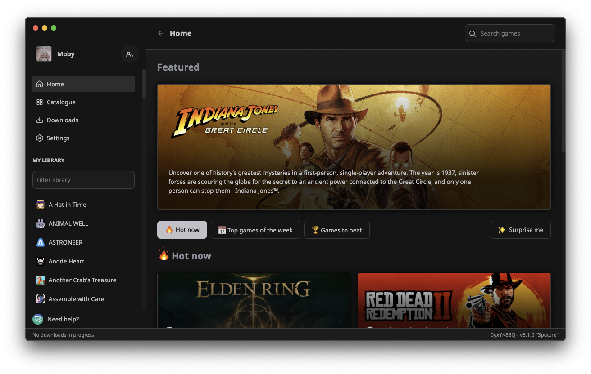

  <h1 align="center">KTM Launcher</h1>

  

    <strong>KTM Launcher is an open-source gaming platform created to be the single tool that you need in order to manage your gaming library. KTM is written in Node.js (Electron, React, Typescript), Python, and Rust.</strong>
  

## Features

- Add games that you own to your library
- Have a nice profile that shows what you are playing to your friends
- Save your game progress in the cloud with KTM Cloud
- Unlock achievements
- Navigate through a rich catalogue with a powerful suggestion algorithm
- Discover new games that you haven't played before

## Build from source and contributing

Please, refer to our Documentation pages: [docs.ktmlauncher.gg](https://docs.ktmlauncher.gg/getting-started)

### Local development requirements

- Node.js + Yarn
- Python 3.9+ with `pip install -r requirements.txt`
- Rust toolchain (for `ktm-native`)

After installing dependencies, `postinstall` now builds the Rust native addon automatically (`ktm-native/ktm-native.node`).

Packaging scripts (`yarn build:win`, `yarn build:mac`, `yarn build:linux`, `yarn build:unpack`) now run `yarn build:python-rpc` automatically.

## Contributors

## License

KTM is licensed under the [MIT License](LICENSE).
